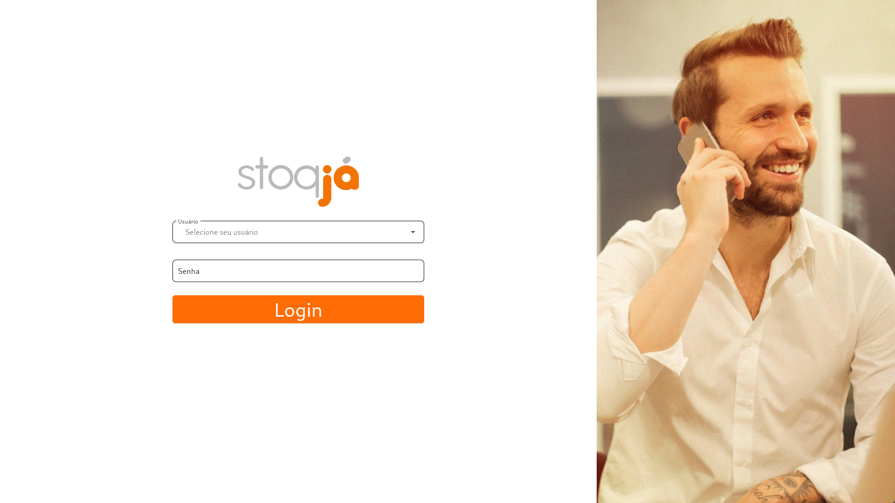
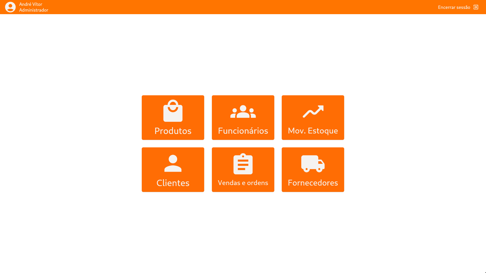
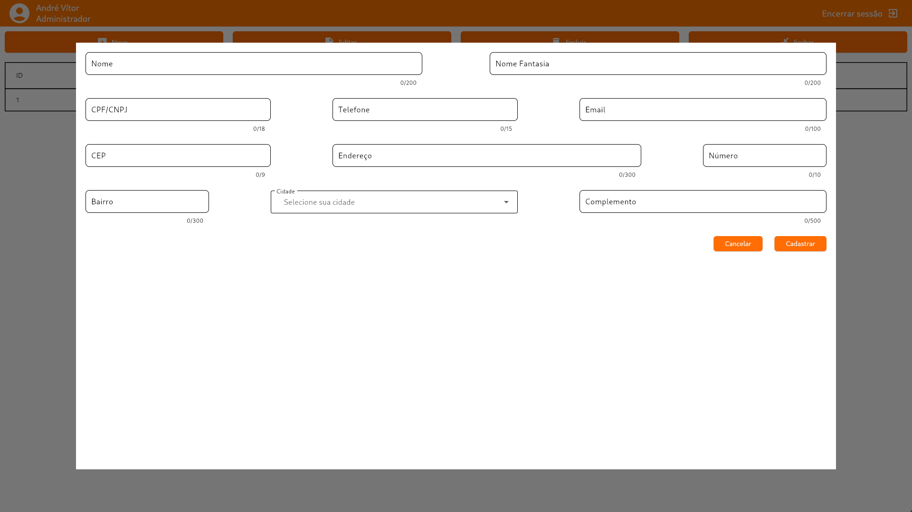
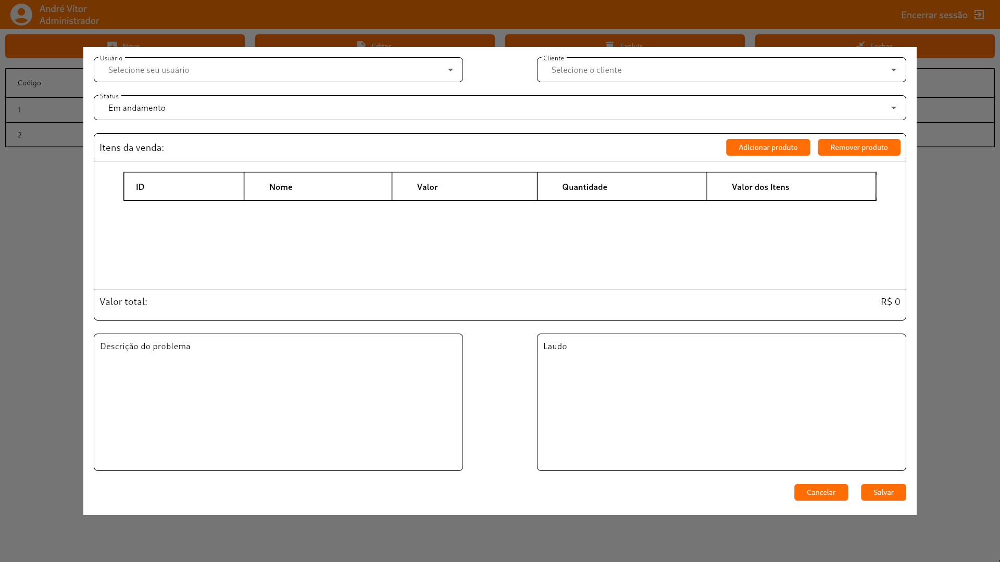
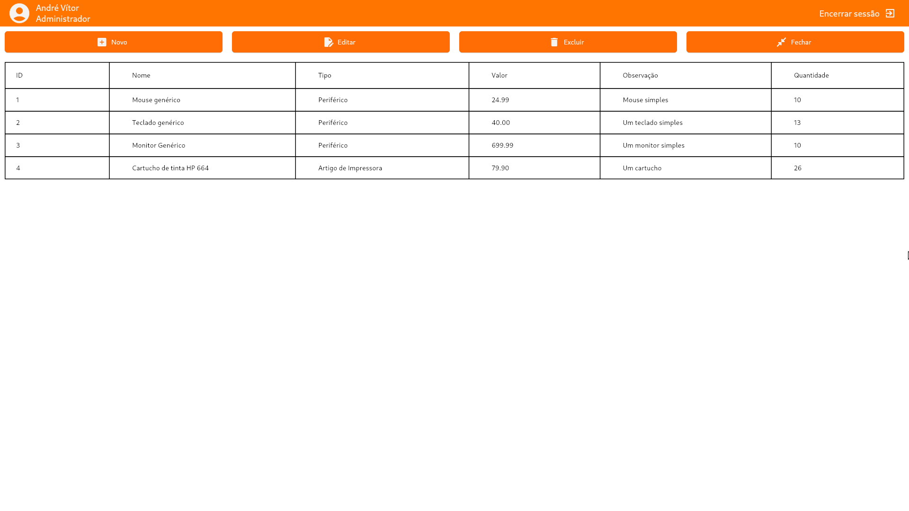
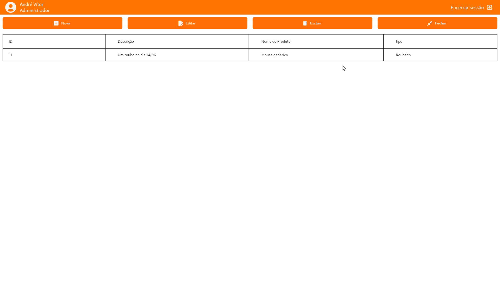

<p align="center"> </p>

<h1 align="center">stoqJá</h1>

<div align="center">
    Um ERP de código aberto e multiplataforma, simples e rápido.
    <br>
    <sub>Disponível para Windows, Linux e Android</sub>
</div>

<br>

<div align="center">

[](LICENSE)


</div>

## Sobre o stoqJá
O stoqJá é um software de gestão de estoque e vendas multiplataforma de código aberto feito com Flutter, visando simplicidade e eficiência. Suas funcionalidades incluem:
- Gerenciamento de entidades (clientes, funcionários e fornecedores);
- Controle do estoque;
- Fácil visualização das vendas realizadas.

Além disso, por possuir a licença MIT, você pode fazer sua própria versão do software, seja ela pública ou privada. 

## Screenshots do app

| Tela de login                              | Tela de menu                      |
|:---------------------------------:         |:---------------------------------:|
|                  |          |
| Cadastro de clientes                       | Cadastro de vendas                |
|        |        |
| Tela de Produtos                           | Tela de Movimentação de estoque   |
|               |       |


## Requisitos
Atualmente, o stoqJá não possui uma versão instalável, portanto você precisa fazer um clone do repositório e fazer a build por conta própria. Para fazer isso com sucesso, você precisa atender aos seguintes requisitos:

- Git;
- Flutter 3.22 ou superior;
- MySQL 8.3.

Tendo todos os requisitos, você pode seguir para a etapa de [implementação](#como-implementar-o-software).

## Como implementar o software
Para fazer a implementação do software da maneira mais simples possível, dividirei o procedimento em X etapas, são elas:

1. [Fazer o clone do repositório](#1-clonando-o-repositório);
2. [Criar o banco de dados](#2-criando-o-banco-de-dados);
3. [Configurar o banco de dados no projeto](#3-configurando-o-banco-de-dados-no-projeto);
4. [Fazer a build](#4-fazendo-a-build-do-projeto).

#### 1. Clonando o repositório
Essa etapa é super simples, basta rodar o comando abaixo:
``` bash
$ git clone https://github.com/andreschenato/stoqja.git
```

Feito isso você terá uma pasta do projeto na sua máquina.

#### 2. Criando o banco de dados
Para criar o banco de dados, há no repositório do projeto um script [banco.sql](banco.sql) que você pode executar com seu SGBD de preferência. 

Tudo que você precisa fazer é executar esse script e esperar o SGBD completar a execução. O que ele fará é:
- Criar as tabelas e as relações entre elas;
- Inserir na tabela *Cidades* todos os 5570 municípios do Brasil.

Foram testados os SGBD's [MySQL Workbench](https://www.mysql.com/products/workbench/) e o [DBeaver](https://dbeaver.io/download/), ambos realizam o trabalho muito bem.

#### 3. Configurando o banco de dados no projeto
Dentro do projeto há uma pasta chamada _database_, e dentro dela há um arquivo chamado _db_variables_example.dart_, nele há comentários e um arquivo de exemplo de como utilizar ele, mas de maneira resumida, tudo que você precisa fazer é:

1. Fazer uma cópia desse arquivo na mesma pasta;
2. Renomear a cópia para _db_variables.dart_;
3. Editar o nome da classe, mudando ela de `DBVarExample` para `DBVar`.

Segue um exemplo de como o arquivo _db_variables.dart_ deve ficar:
```dart
class DBVar {
  static const host = 'localhost';
  static const port = 3306;
  static const user = 'user';
  static const pass = 'pasword';
  static const schema = 'stoqja';
}
```

Com isso feito, você está pronto para editar o software do seu jeito ou prosseguir com a [build](#4-fazendo-a-build-do-projeto).

#### 4. Fazendo a build do projeto
**ATENÇÃO:** Para que a build para Android funcione, você precisa configurar o banco de dados para um endereço ip que o dispositivo possa ter acesso, caso contrário, o aplicativo não irá ser capaz de acessar o banco de dados!

Para fazer a build do projeto, é recomendável seguir a própria [documentação do Flutter](https://docs.flutter.dev/).
